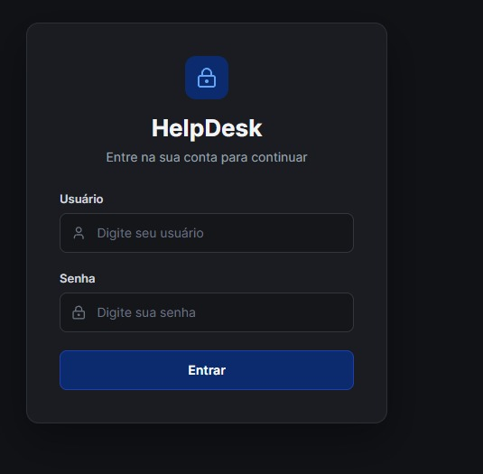
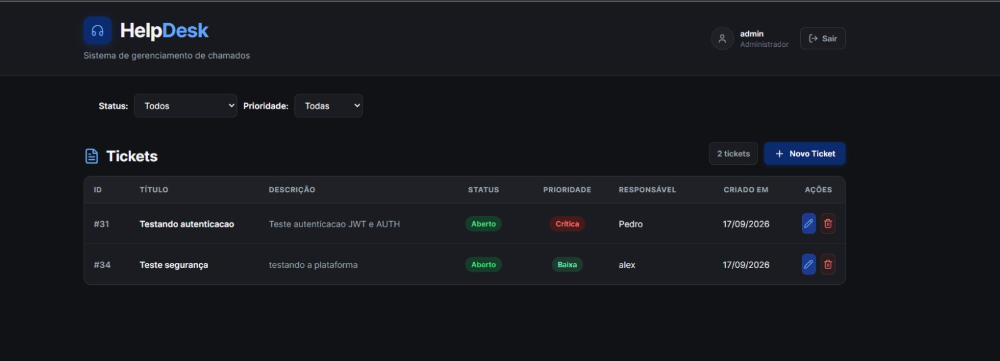
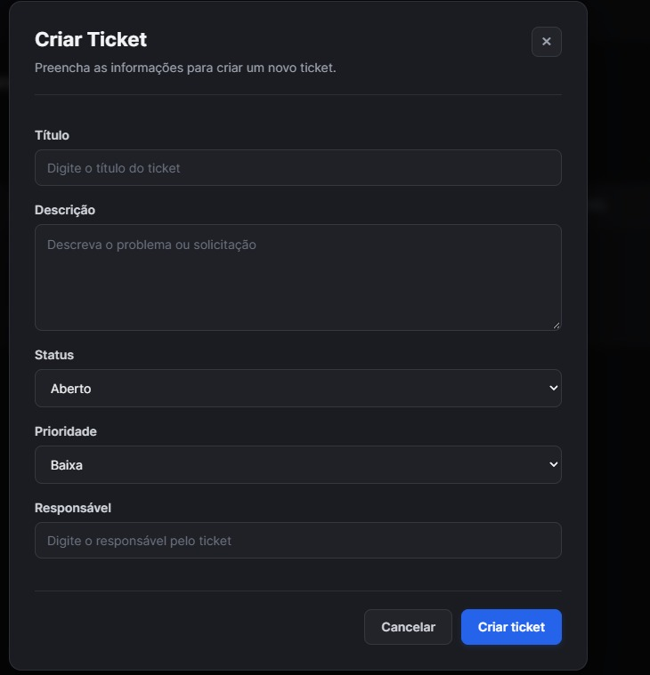
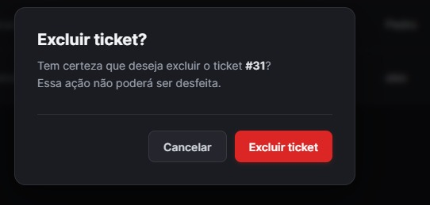

# HelpDesk

Sistema full-stack para gerenciamento de chamados (tickets), desenvolvido com Java, Spring Boot, Spring Security, JWT, React, TypeScript e PostgreSQL.

O projeto foi desenvolvido com foco em boas práticas de desenvolvimento, organização em camadas, autenticação, autorização por perfil de usuário, validação de dados e integração entre uma API REST e uma aplicação web.

---

## Tecnologias

### Backend

- Java 17
- Spring Boot 4
- Spring Web MVC
- Spring Data JPA
- Spring Security
- JWT
- PostgreSQL
- Maven
- Lombok
- Bean Validation
- SpringDoc OpenAPI / Swagger

### Frontend

- React
- TypeScript
- Vite
- CSS
- Lucide React

### Infraestrutura

- PostgreSQL
- Docker / Docker Compose

---

##  Funcionalidades

### Autenticação e autorização

- Login utilizando username e senha
- Autenticação baseada em JWT
- Controle de acesso baseado em roles
- Perfis `USER` e `ADMIN`
- Proteção dos endpoints da API
- Senhas armazenadas utilizando hashing

### Gerenciamento de tickets

- Criação de tickets
- Visualização de tickets
- Edição de tickets
- Exclusão de tickets
- Visualização detalhada
- Filtro por status
- Filtro por prioridade
- Paginação
- Definição de responsável
- Registro da data de criação

### Backend

- API REST
- DTOs para entrada e saída de dados
- Validação de requisições
- Tratamento global de exceções
- Persistência utilizando JPA/Hibernate
- Consultas utilizando Spring Data JPA
- Documentação da API com Swagger/OpenAPI
- Configuração de CORS
- Configuração externa de credenciais e secrets

---

##  Controle de acesso

O sistema possui dois níveis de acesso:

| Funcionalidade | USER | ADMIN |
|---|:---:|:---:|
| Visualizar tickets | ✅ | ✅ |
| Criar tickets | ❌ | ✅ |
| Editar tickets | ❌ | ✅ |
| Excluir tickets | ❌ | ✅ |

As permissões são validadas no backend utilizando Spring Security.

---

##  Arquitetura

O backend foi organizado seguindo uma separação por responsabilidades:

```text
src/main/java/com/alexandre/helpdesk
│
├── config
│   ├── DataInitializer
│   ├── OpenApiConfig
│   ├── SecurityConfig
│   └── WebConfig
│
├── controller
│   ├── AuthController
│   └── TicketController
│
├── dto
│   ├── LoginRequest
│   ├── LoginResponse
│   ├── PageResponse
│   ├── TicketRequest
│   └── TicketResponse
│
├── entity
│   ├── Role
│   ├── Ticket
│   ├── TicketPriority
│   ├── TicketStatus
│   └── User
│
├── exception
│   ├── ErrorResponse
│   ├── GlobalExceptionHandler
│   ├── InvalidEnumValueException
│   └── ResourceNotFoundException
│
├── repository
│   ├── TicketRepository
│   └── UserRepository
│
└── service
    ├── CustomUserDetailsService
    ├── JwtService
    └── TicketService

React + TypeScript
        │
        │ HTTP / REST
        ▼
Spring Boot API
        │
        ├── Spring Security + JWT
        │
        ├── Controllers
        │
        ├── Services
        │
        ├── Repositories
        │
        ▼
    PostgreSQL


 Principais endpoints
Autenticação
POST /auth/login


Realiza a autenticação do usuário e retorna um token JWT.

Tickets
GET    /tickets
GET    /tickets/{id}
POST   /tickets
PUT    /tickets/{id}
DELETE /tickets/{id}

Os endpoints de criação, edição e exclusão exigem perfil ADMIN.

 Filtros e paginação

A API permite consultar tickets utilizando filtros de status e prioridade.

Exemplo:

GET /tickets?status=OPEN&priority=HIGH

A listagem também utiliza paginação através dos recursos do Spring Data.

 Banco de dados

O projeto utiliza PostgreSQL para persistência dos dados.

Banco utilizado localmente:

helpdesk

As credenciais do banco não ficam armazenadas diretamente no código-fonte.

A aplicação utiliza variáveis de ambiente:

DB_URL
DB_USERNAME
DB_PASSWORD
JWT_SECRET

Um arquivo .env.example está disponível no projeto para demonstrar as variáveis necessárias.

 Configuração do ambiente
Pré-requisitos

Antes de executar o projeto, tenha instalado:

Java 17
Maven ou Maven Wrapper
PostgreSQL
Node.js
npm
Docker (opcional)
1. Clone o repositório
git clone https://github.com/alexandreneto97/helpdesk.git

Entre no projeto:

cd helpdesk
2. Configure as variáveis de ambiente

Utilize o arquivo .env.example como referência:

DB_URL=jdbc:postgresql://localhost:5432/helpdesk
DB_USERNAME=postgres
DB_PASSWORD=your_database_password
JWT_SECRET=your_super_secret_key_with_at_least_32_characters

Configure essas variáveis no ambiente utilizado para executar o backend.

3. Crie o banco de dados

No PostgreSQL:

CREATE DATABASE helpdesk;
4. Execute o backend

No Windows:

mvnw.cmd spring-boot:run

Ou execute a classe principal:

HelpdeskApplication

A API estará disponível em:

http://localhost:8080
 Swagger

A documentação da API está disponível através do Swagger UI:

http://localhost:8080/swagger-ui/index.html

A especificação OpenAPI pode ser acessada em:

http://localhost:8080/v3/api-docs
 Usuários para demonstração

O projeto possui usuários de demonstração criados automaticamente para facilitar os testes locais.

Administrador
Username: admin
Password: admin123
Role: ADMIN
Usuário
Username: user
Password: user123
Role: USER

As credenciais acima são destinadas exclusivamente ao ambiente de demonstração/local e não devem ser utilizadas em produção.

 Interface

A aplicação possui uma interface web com:

Tela de login
Dashboard de tickets
Filtros
Paginação
Indicadores de status e prioridade
Modal de visualização
Modal de criação e edição
Confirmação de exclusão
Controle visual baseado no perfil do usuário
Interface responsiva
Tema escuro
Screenshots

Screenshots da aplicação serão adicionados aqui.

##  Screenshots

### Tela de Login



### Aplicação



### Criação de Ticket



### Exclusão de Ticket




 Validações e segurança

O projeto possui diferentes mecanismos para proteger a aplicação:

Autenticação utilizando JWT
Autorização baseada em roles
Senhas armazenadas com hashing
Validação dos dados recebidos pela API
Tratamento global de exceções
CORS configurado
Endpoints protegidos
Secrets configurados através de variáveis de ambiente

As regras de autorização são aplicadas no backend, garantindo que as permissões não dependam apenas da interface do usuário.

 Estrutura do projeto
helpdesk/
│
├── src/
│   ├── main/
│   │   ├── java/
│   │   └── resources/
│   │
│   └── test/
│
├── .env.example
├── .gitignore
├── docker-compose.yml
├── mvnw
├── mvnw.cmd
├── pom.xml
└── README.md
 Objetivo do projeto

Este projeto foi desenvolvido como um projeto de portfólio para demonstrar conhecimentos em desenvolvimento full-stack, incluindo:

Desenvolvimento de APIs REST
Java e Spring Boot
Spring Security
Autenticação e autorização com JWT
Persistência com PostgreSQL
Desenvolvimento de interfaces com React e TypeScript
Integração entre frontend e backend
Organização e separação de responsabilidades
Boas práticas de versionamento e configuração
 Autor

Alexandre Koutroularis

Desenvolvedor Full Stack com experiência em Java, Spring Boot, React, Angular, PostgreSQL e desenvolvimento de aplicações web.
